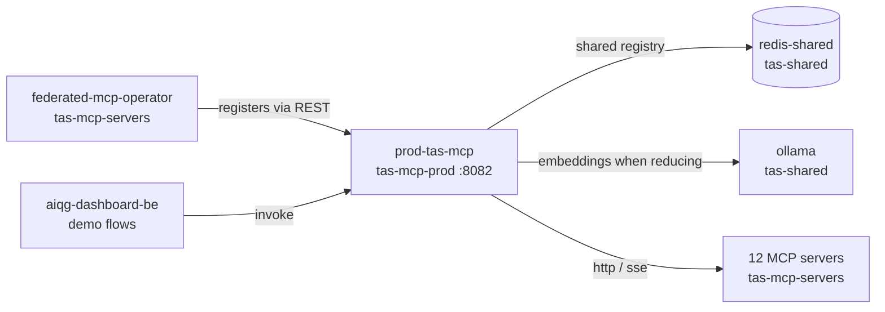

# 📡 TAS MCP — a Model Context Protocol (MCP) federation gateway

[](https://github.com/tributary-ai-services/tas-mcp/actions)
[](https://goreportcard.com/report/github.com/tributary-ai-services/tas-mcp)
[](https://github.com/tributary-ai-services/tas-mcp#quick-start)
[](https://pkg.go.dev/github.com/tributary-ai-services/tas-mcp)
[](LICENSE)

[](https://golang.org)
[](https://www.docker.com)
[](https://kubernetes.io)

## What this is

One address in front of many MCP servers. A caller sends the gateway `POST /api/v1/federation/servers/{id}/invoke` with an MCP method such as `tools/list` or `tools/call`; the gateway looks the server up in its registry, attaches whatever outbound credential that server needs, forwards the call over that server's transport, and hands the result back. On the way back out it does two more things to `tools/call` results: it scans them for sensitive content with Gatekeeper, and — for servers that opted in — it shrinks them before an agent pays to put them in a prompt.

Two things this is **not**. It is not itself an MCP server: it exposes no tools of its own, and an MCP client cannot point at it and get a tool list. And it is not where the federated servers live — those are deployed from the sibling `tas-mcp-servers` repository, which also owns the operator that registers them here.

The same binary still carries an older event-ingest and forwarding path (`/api/v1/events`, plus a gRPC stream on port 50052) that routes events to webhook and Kafka targets by rule. It is wired into the same process in [`cmd/server/main.go`](cmd/server/main.go), and in production it is idle — the running gateway reports `"total_events": 0` after 8.8 days of uptime.

## Status & scope

**As of 2026-08-26.** In production as Deployment `prod-tas-mcp` in namespace `tas-mcp-prod`, 5 replicas, image `registry-api.tas.scharber.com/tas-mcp:obs-20260817`, scaled by a HorizontalPodAutoscaler (HPA) between 5 and 50. The base manifests declare a `tas-mcp` namespace ([`k8s/base/namespace.yaml:4`](k8s/base/namespace.yaml)), but no such namespace exists in the cluster — only `tas-mcp-prod` does. The gateway has no ingress either: it is reachable only from inside the cluster, at `prod-tas-mcp-http.tas-mcp-prod.svc.cluster.local:8082`.

Twelve servers are federated, all registered through the `FederatedMCPServer` custom resource definition (CRD) by the `federated-mcp-operator` running in `tas-mcp-servers`. Probing every one of them through the gateway today, all twelve answered `tools/list`:

| Server | Transport path | `reduce` | Tools returned |
|---|---|---|---|
| `assembler-mcp` | native HTTP | `true` | 4 |
| `context7-mcp` | bridge, stdio spawn | `true` | 2 |
| `dbhub` | native Server-Sent Events (SSE) | unset | 2 |
| `grafana-mcp` | bridge, stdio spawn | unset | 43 |
| `kafka-mcp` | bridge over sidecar HTTP | unset | 9 |
| `minio-mcp` | bridge over sidecar HTTP | unset | 23 |
| `napkin-mcp` | native HTTP | `true` | 6 |
| `neo4j-mcp` | bridge, stdio spawn | unset | 3 |
| `paper-search-mcp` | bridge, stdio spawn | `true` | 19 |
| `podcast-mcp` | native HTTP | `true` | 6 |
| `postgres-mcp` | bridge, stdio spawn | `false` | 1 |
| `sequential-thinking-mcp` | bridge, stdio spawn | unset | 1 |

Reduce-at-source and boundary scanning are both switched on in production (`REDUCTION_ENABLED=true`, `SCANNING_ENABLED=true`). Reduction is real and measurable — the most recent firing in Loki is from 2026-08-18 against `paper-search-mcp`, dropping about two thirds of the returned bytes (capture in [Quick start](#quick-start)). Scanning runs in detect-only mode, because `SCANNING_REDACT` is unset and its default is `false` ([`internal/scanning/scanner.go:33`](internal/scanning/scanner.go)).

What is **not** what a first read of this repository might suggest:

- **Aggregate health is not a liveness signal.** `GET /api/v1/federation/health` returns `"unknown"` for all twelve servers. Periodic checks only run for servers whose `HealthCheck.Enabled` is set ([`internal/federation/manager.go:643`](internal/federation/manager.go)), and the CRD has no field that sets it, so the status recorded in the registry never moves off its initial value. Per-server `GET /api/v1/federation/servers/{id}/health` does perform a live check, but only after that replica has built the service — see the 503 in [Quick start](#quick-start).
- **`/api/v1/metrics` is JSON, not Prometheus text.** It returns `{"uptime":762415533}`. No Prometheus client library is imported anywhere in `internal/` or `cmd/`; the handler is a JSON encoder at [`internal/http/server.go:403`](internal/http/server.go). The `ServiceMonitor` in [`k8s/base/servicemonitor.yaml:15`](k8s/base/servicemonitor.yaml) scrapes `/metrics` on the health port, which no handler serves, and the ServiceMonitor CRD is not installed in this cluster. Nothing is scraping this service.
- **`k8s/overlays/prod` is a template, not a description of production.** It pins image tag `v1.0.0` and includes an ingress for host `api.tas-mcp.com`; the live Deployment runs a different tag and no ingress object exists in `tas-mcp-prod`.
- **The registry catalogue holds 14 entries**, not the 1,535 figure that appears in [ROADMAP.md](ROADMAP.md) — that is a target, not an inventory.
- **The servers under `deployments/`** (DuckDuckGo, Apify, Playwright, Slack, GitHub, Git, PostgreSQL) are Node.js scaffolding for local Docker Compose work, not part of the gateway. None of them run in the cluster and none are among the twelve federated servers. Node.js is not needed to build or run the gateway at all — the only other use of it here is `npm run validate` in `registry/`, which checks the catalogue against its JSON schema.
- **There is no Helm chart, no rate limiting, and no circuit breaker.** `RateLimit` exists as a config struct on forwarding targets only.

## Quick start

### A fresh clone does not compile on its own

`go.mod:22` resolves Gatekeeper through a relative path — `replace github.com/Tributary-ai-services/Gatekeeper => ../Gatekeeper` — so the sibling checkout has to exist first. Without it:

```console
$ go build ./...
internal/reduction/reducer.go:17:2: github.com/Tributary-ai-services/Gatekeeper@v0.0.0-00010101000000-000000000000: replacement directory ../Gatekeeper does not exist
internal/scanning/scanner.go:16:2: github.com/Tributary-ai-services/Gatekeeper@v0.0.0-00010101000000-000000000000: replacement directory ../Gatekeeper does not exist
```

Clone the two side by side, the way [`.github/workflows/ci.yml:33`](.github/workflows/ci.yml) does:

```console
$ git clone https://github.com/Tributary-ai-services/tas-mcp.git
$ git clone --depth 1 https://github.com/Tributary-ai-services/Gatekeeper.git
$ ls
Gatekeeper  tas-mcp
```

### Build and test

`make build` passes `-tags nohs`, which selects Gatekeeper's Go-regexp match engine so no Hyperscan headers are needed locally ([`Makefile:27`](Makefile)). Drop the tag only if you have `libhyperscan-dev` and `pkg-config` installed — without them the untagged build stops at `github.com/flier/gohs/internal/hs: exec: "pkg-config": executable file not found`.

```console
$ make build
Building tas-mcp (regexp engine; Docker image uses Hyperscan)...
go build -tags nohs -ldflags "-X main.version=dev" -o bin/tas-mcp ./cmd/server

$ make test
Running unit tests...
go test -tags nohs -v -race -coverprofile=coverage.out ./internal/...
ok  github.com/tributary-ai-services/tas-mcp/internal/config       1.023s  coverage: 74.2% of statements
ok  github.com/tributary-ai-services/tas-mcp/internal/federation  11.309s  coverage: 71.2% of statements
ok  github.com/tributary-ai-services/tas-mcp/internal/forwarding   1.133s  coverage: 60.0% of statements
ok  github.com/tributary-ai-services/tas-mcp/internal/grpc         1.024s  coverage: 49.2% of statements
ok  github.com/tributary-ai-services/tas-mcp/internal/http         1.024s  coverage: 48.9% of statements
ok  github.com/tributary-ai-services/tas-mcp/internal/reduction    1.019s  coverage: 82.0% of statements
ok  github.com/tributary-ai-services/tas-mcp/internal/scanning     1.067s  coverage: 41.9% of statements
```

Everything passes; aggregate statement coverage across `./internal/...` is 62.9%. Two lines printed by the federation suite (`Health check failed (expected for mock): ... connect: connection refused`) are a deliberate negative case, not a failure.

The container image is a different build: it compiles the Intel Hyperscan engine with `CGO_ENABLED=1`, and it copies `Gatekeeper/` in from alongside the app directory at [`Dockerfile:32`](Dockerfile), which means the build context is the **parent** directory, not the repository. Continuous integration builds it as `docker build -f Dockerfile -t tas-mcp:latest ..` from inside the checkout ([`.github/workflows/ci.yml:208`](.github/workflows/ci.yml)). `make docker` and the `context: .` in `docker-compose.yml` still pass the repository itself and will fail on the missing `Gatekeeper/` directory. [!UNVERIFIED] The image build was not executed here — no Docker daemon was available in this environment — so only the context requirement is confirmed, from the Dockerfile and the workflow.

### Run it and make one call

The gateway's own API takes no credential: there is no authentication middleware on the router, only logging and cross-origin headers ([`internal/http/server.go:88`](internal/http/server.go)). Credentials in this system are **outbound** — the gateway holds per-server credentials to authenticate *to* downstream servers ([`internal/federation/auth.go:220`](internal/federation/auth.go)). The registry starts empty, so a fresh process federates nothing until you register something.

```console
$ ./bin/tas-mcp
2026-08-26T13:39:00.299-1000  INFO  server/main.go:53   Starting TAS MCP Server  {"version": "dev", "http_port": 8082, "grpc_port": 50052, "log_level": "info"}
2026-08-26T13:39:00.299-1000  INFO  federation/manager.go:483  Starting federation manager
2026-08-26T13:39:00.299-1000  INFO  server/main.go:108  Federation gateway enabled  {"reduce_at_source": false, "boundary_scanning": false}
2026-08-26T13:39:00.306-1000  INFO  server/main.go:215  Starting gRPC server  {"port": 50052}
2026-08-26T13:39:00.307-1000  INFO  server/main.go:244  Starting HTTP server  {"port": 8082}
2026-08-26T13:39:00.307-1000  INFO  server/main.go:312  Starting health check server  {"port": 8083}

$ curl -sS http://localhost:8082/health
{"status":"healthy","timestamp":"2026-08-26T13:39:34.344936727-10:00","version":"1.0.0","uptime":"31.238577892s","stats":{"total_events":0,"stream_events":0,"forwarded_events":0,"error_events":0,"active_streams":0}}
```

Use `:8082/health` rather than the separate health-check listener on `:8083`. That second listener formats its body with Go's `%v` verb and emits `"stats": map[active_streams:0 error_events:0 ...]`, which is not parseable JSON — fine for a Kubernetes probe, wrong for anything that reads it.

Now federate one server. Any HTTP-speaking MCP server works; this capture forwards a cluster service to the laptop first with `kubectl port-forward -n tas-mcp-servers svc/sequential-thinking-mcp 18000:8000`.

**The first failure you will hit** is omitting `auth` on the registration. The field has no usable zero value:

```console
$ curl -sS -X POST http://localhost:8082/api/v1/federation/servers/local-seq/invoke \
    -H 'Content-Type: application/json' -d '{"id":"1","method":"tools/list","params":{}}'
{"id":"1","error":{"code":-1,"message":"apply auth for local-seq: unsupported authentication type: "}}
```

Register with an explicit `"auth": {"type": "none"}` — the same thing the operator writes for every server that needs no credential — and the call goes through:

```console
$ curl -sS -X POST http://localhost:8082/api/v1/federation/servers \
    -H 'Content-Type: application/json' \
    -d '{"id":"local-seq","name":"Sequential Thinking","category":"reasoning","endpoint":"http://localhost:18000","protocol":"http","auth":{"type":"none"}}'
{"message":"Server registered successfully","server_id":"local-seq"}

$ curl -sS -X POST http://localhost:8082/api/v1/federation/servers/local-seq/invoke \
    -H 'Content-Type: application/json' -d '{"id":"1","method":"tools/list","params":{}}'
{"id":"1","result":{"tools":[{"name":"sequentialthinking","description":"A detailed tool for dynamic and reflective problem-solving through thoughts. ...
```

That is the whole loop: register, invoke, get the downstream server's own result back.

### Against the deployed gateway

There is no ingress, so reach production through a port-forward. The 503 below is worth understanding rather than reporting: with the shared Redis registry, a definition registered on one replica exists for all five, but each replica builds its live client lazily on first invoke ([`internal/federation/manager.go:291`](internal/federation/manager.go)). Before that, `CheckHealth` finds nothing local and says so; after one invoke, the same call succeeds.

```console
$ kubectl port-forward -n tas-mcp-prod svc/prod-tas-mcp-http 18082:8082 &
$ curl -sS http://localhost:18082/api/v1/federation/servers/sequential-thinking-mcp/health
{"error":"server with ID sequential-thinking-mcp not found","server_id":"sequential-thinking-mcp","status":"unhealthy","timestamp":"2026-08-26T23:35:00Z"}

$ curl -sS -X POST http://localhost:18082/api/v1/federation/servers/sequential-thinking-mcp/invoke \
    -H 'Content-Type: application/json' -d '{"id":"probe","method":"tools/list","params":{}}' > /dev/null
$ curl -sS http://localhost:18082/api/v1/federation/servers/sequential-thinking-mcp/health
{"error":null,"server_id":"sequential-thinking-mcp","status":"healthy","timestamp":"2026-08-26T23:35:16Z"}
```

Reduction shows up in Loki, not in a metrics endpoint. One line per `tools/call` on an opted-in server, logged at info level when bytes were saved:

```console
$ kubectl port-forward -n tas-shared svc/loki-shared 13100:3100 &
$ curl -sS -G http://localhost:13100/loki/api/v1/query_range \
    --data-urlencode 'query={namespace="tas-mcp-prod"} |= "reduce-at-source"' --data-urlencode 'limit=2'
2026-08-18T04:05:10.154Z  INFO  federation/reducing_processor.go:156  reduce-at-source: reduced  {"tool": "search_papers", "blocks": 1, "bytes_in": 17134, "bytes_saved": 11561, "cache_hits": 0, "reduce_errors": 0, "query_len": 38, "saved_pct": 67.4740282479281}
2026-08-18T04:05:07.023Z  INFO  federation/reducing_processor.go:156  reduce-at-source: reduced  {"tool": "search_papers", "blocks": 1, "bytes_in": 34344, "bytes_saved": 23206, "cache_hits": 0, "reduce_errors": 0, "query_len": 42, "saved_pct": 67.56929885860703}
```

Calls that reduced nothing log at debug level with a `reason` field, and production runs at `LOG_LEVEL=info`, so an absence of lines here means either no `tools/call` traffic or no saving — raise the level to tell those apart.

## Three transport paths to a federated server

This is the decision to get right when adding a server, and the three paths are easy to conflate because all twelve entries look alike in the registry: eleven say `protocol: http` and one says `sse`. That field describes only the hop **from the gateway**. What sits at the other end differs:

1. **Bridge with a spawned stdio process.** The `tas-mcp-bridge:1.1.0` image runs alone in the pod, launches the upstream MCP server as a child process over standard input and output, and presents it as HTTP on port 8000. Configured with `MCP_COMMAND` and `MCP_ARGS` — `neo4j-mcp` runs `uvx` with `["mcp-neo4j-cypher", "--transport", "stdio"]`, `sequential-thinking-mcp` runs `npx -y @modelcontextprotocol/server-sequential-thinking`. Six of the twelve use this. Reach for it when the upstream server only speaks stdio, which is most published MCP servers.
2. **Bridge in front of a native HTTP server in the same pod.** Two containers: the vendor's own server listening on localhost, and `tas-mcp-bridge:1.0.0` beside it with `MCP_HTTP_UPSTREAM` pointing at it — `http://localhost:8080/mcp` for `kafka-mcp`, `http://localhost:8090/mcp` for `minio-mcp`. Those two are the only users. Reach for it when the upstream already speaks HTTP but not in the shape the gateway expects. Earlier revisions of both took path 1 instead, spawning `npx -y mcp-remote http://localhost:8080/mcp`; the live pod specs no longer do, so treat `mcp-remote` as history rather than the current arrangement.
3. **Native.** The server speaks HTTP or SSE itself and the gateway talks to it directly, with no bridge container: `assembler-mcp`, `napkin-mcp`, `podcast-mcp` over HTTP, and `dbhub` over SSE, which is handled by a separate client implementing the Streamable-HTTP transport ([`internal/federation/service_sse.go`](internal/federation/service_sse.go)). Reach for it when you control the server.

One cluster-specific trap: transport-layer security is disabled on the shared Neo4j's Bolt port, so a Neo4j-backed server needs a plain `bolt://` URL rather than the `neo4j+s://` form most documentation shows. The live `neo4j-mcp` runs with `NEO4J_URI=bolt://neo4j.aether-be.svc.cluster.local:7687`. [!UNVERIFIED] The `neo4j+s://` failure was not reproduced here — the requirement comes from the platform-wide note that Bolt runs without transport-layer security in this cluster, plus the working value above.

Payload reduction is **per server, off by default** — `Reduce` is a boolean on the server record ([`internal/federation/types.go:26`](internal/federation/types.go)), set through the `reduce` field of the `FederatedMCPServer` custom resource, and the gateway consults it on every `tools/call` before running the reducer ([`internal/federation/manager.go:374`](internal/federation/manager.go)). Five of the twelve opt in. Scanning is not gated that way: it runs on every external tool result regardless, because it is the security control at the boundary rather than an optimisation.

## How it fits



**Redis is a soft dependency.** With `FEDERATION_REGISTRY=redis` the five replicas share one registry, so a registration on any pod is visible to all. If Redis cannot be reached at startup the gateway logs the error and falls back to an in-process registry rather than refusing to start ([`cmd/server/main.go:119`](cmd/server/main.go)) — the process stays up, but each replica then knows only what it was told directly, and a caller load-balanced to another pod gets `server with ID ... not found`.

**Gatekeeper is a hard build dependency** and a soft runtime one. The build cannot resolve without the sibling checkout; at runtime both the scanner and the reducer no-op unless their feature flags are set.

**Who calls it.** The `federated-mcp-operator` in `tas-mcp-servers` reconciles `FederatedMCPServer` resources into registrations against `TAS_MCP_GATEWAY_URL=http://prod-tas-mcp-http.tas-mcp-prod.svc.cluster.local:8082`. `aiqg-dashboard-be` points its demo-flow generator at the same address. Worth knowing: `tas-agent-builder` does **not** go through the gateway — its `MCP_SERVER_URL` targets `napkin-mcp` directly, so changes here do not affect it.

**Where the servers live.** Every downstream server, its bridge configuration, its ingress and its secrets are in `tas-mcp-servers`. This repository owns the gateway and the CRD contract it consumes.

## Configuration

Read from the environment at startup ([`internal/config/config.go`](internal/config/config.go)), or from a JSON file passed with `-config`. The settings that change behaviour, with the values the production Deployment actually sets:

| Variable | Default | In `prod-tas-mcp` | What it changes |
|---|---|---|---|
| `HTTP_PORT` | `8082` | `8082` | Federation and event API listener |
| `GRPC_PORT` | `50052` | `50052` | Event streaming listener |
| `HEALTH_CHECK_PORT` | `8083` | `8083` | Probe-only listener |
| `LOG_LEVEL` | `info` | `info` | At `info`, reduction no-op reasons stay hidden |
| `FEDERATION_REGISTRY` | `memory` | `redis` | Shared registry across replicas versus per-pod |
| `FEDERATION_REDIS_URL` | `redis://redis-shared.tas-shared.svc.cluster.local:6379/0` | same | Registry backend |
| `REDUCTION_ENABLED` | `false` | `true` | Installs the reducer; still per-server gated |
| `REDUCTION_MIN_CONTENT_SIZE` | `0` | `4096` | Results below this are left alone |
| `REDUCTION_EMBED_MODEL` / `REDUCTION_OLLAMA_URL` | empty / `http://ollama:11434` | `all-minilm` / in-cluster Ollama | Embedder used for relevance |
| `SCANNING_ENABLED` | `false` | `true` | Gatekeeper scan of every tool result |
| `SCANNING_REDACT` | `false` | unset | `false` means detect and report, modify nothing |
| `FORWARDING_ENABLED` | `false` | unset | Event forwarding workers and targets |

**Secrets.** The gateway Deployment mounts none — check its pod spec and every value is a literal or a service address. Credentials belong to the downstream servers and live as Kubernetes Secrets in the `tas-mcp-servers` namespace, one per server, consumed through `envFrom`: `neo4j-mcp-secret` carries the Neo4j password for `neo4j-mcp`, and `grafana-mcp-secret`, `minio-mcp-secret` and `napkin-mcp-secret` do the same for theirs. Read them with `kubectl get secret -n tas-mcp-servers`; do not copy values into manifests or into this file. When you register a server that does need a credential, it travels in the `auth.config` map of the registration payload, so treat the registration body as sensitive.

## Where to go next

- [DEVELOPER.md](DEVELOPER.md) — local development loop, code layout, hot reload with `air`
- [docs/API.md](docs/API.md) — endpoint-by-endpoint reference for the federation and event APIs
- [docs/DESIGN.md](docs/DESIGN.md) and [docs/ARCHITECTURE.md](docs/ARCHITECTURE.md) — why the gateway is shaped this way
- [docs/DEPLOYMENT.md](docs/DEPLOYMENT.md) and [k8s/README.md](k8s/README.md) — Kubernetes overlays and rollout steps
- [docs/TROUBLESHOOTING.md](docs/TROUBLESHOOTING.md) — first stop when an invoke fails
- [examples/federation/](examples/federation/README.md) — Go clients that drive the federation API
- [registry/README.md](registry/README.md) — the 14-entry server catalogue and its schema
- [ROADMAP.md](ROADMAP.md) — the large-scale federation vision; read it as intent, not inventory
- [CONTRIBUTING.md](CONTRIBUTING.md) — branch, test and review expectations
- Logs: Grafana Explore against Loki, query `{namespace="tas-mcp-prod"}`

## License

Apache License 2.0 — see [LICENSE](LICENSE). Report security vulnerabilities to security@tributary-ai-services.com.

Built on the [Model Context Protocol](https://github.com/anthropics/model-context-protocol) by Anthropic, with [Argo Events](https://argoproj.github.io/argo-events/) on the event-forwarding side.

---

<p align="center">
  Built with ❤️ by <a href="https://tributary-ai-services.com">Tributary AI Services</a>
</p>
